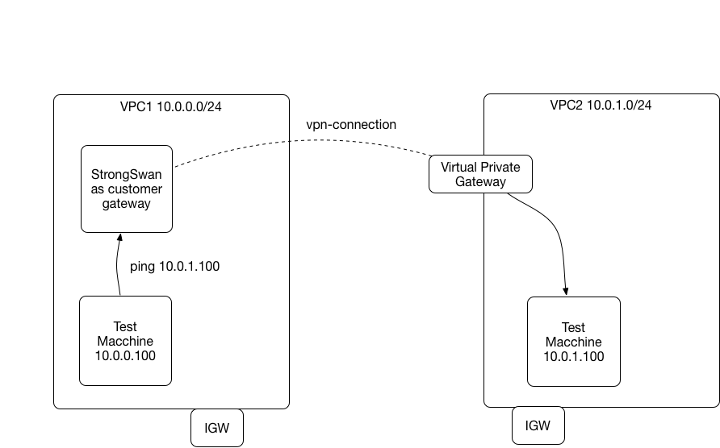
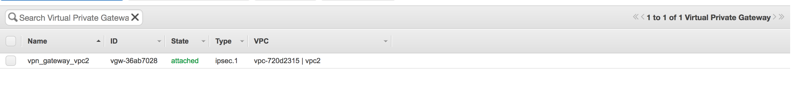
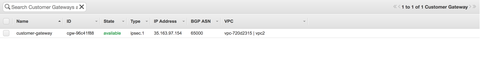
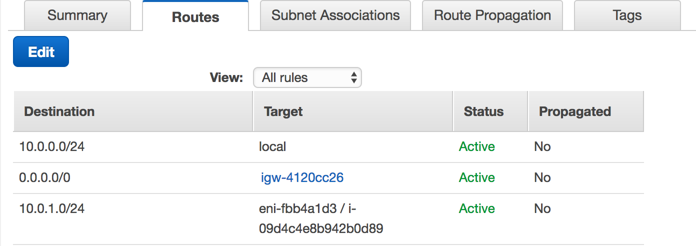
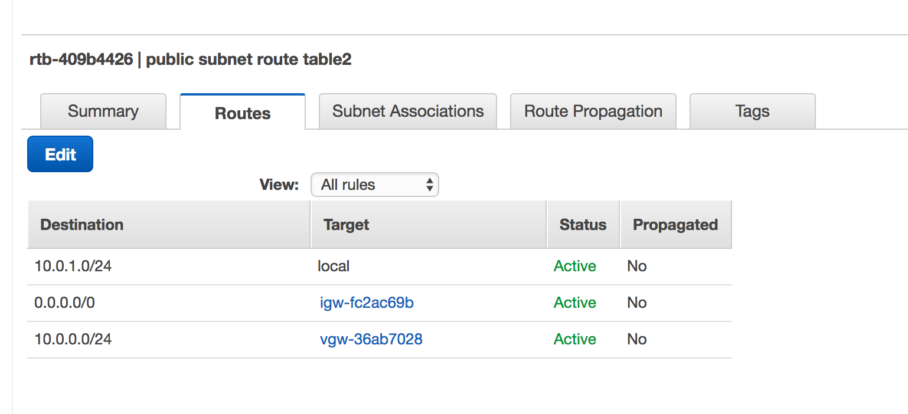

# VPN Peering



## Why

* Bridge the client network and AWS VPC
* Quick way to try out AWS VPN peering without a hardware VPN device
* It is a possible solution for VPC site peering (VPC peering does not support multi site peering)

## How

## Using StrongSwan ipsec (deployed to ubuntu) to create VPN tunnel

## Terraform automate infrastructure:
   * VPC1 hosts test machine and strongswan (customergateway)
   * VPC2 hosts a test machine
   * VPC2 create virtual gateway and peer with customer gateway on VPC1

      
      

   * Route on VPC1 -> VM routes through strongswan instance for VPC2 subnet

   

   * Route on VPC2 -> VM routes through vpn gateway for VPC1 subnet

   

## Run

  * Configure an [env.sh](env.sh.sample)

    ```
    source env.sh
    ```

  * Run terraform apply

    ```
    terraform apply
    ```

  * Find the VPC1 test machine pubic and private ip

    ```
    terraform state show aws_instance.test_machine_vpc1 | grep _ip
    associate_public_ip_address               = true
    private_ip                                = 10.0.0.78
    public_ip                                 = 34.208.229.5
    ```

  * Find the VPC2 test machine public and private ip

    ```
    terraform state show aws_instance.test_machine_vpc2 | grep _ip
    associate_public_ip_address               = true
    private_ip                                = 10.0.1.117
    public_ip                                 = 35.166.171.219
    ```

  * Now you can ping each other machine by using their private ips

    ```
    ssh -i ~/work/aws/personal/pcf-sding.pem ubuntu@34.208.229.5
    ping 10.0.1.117
    ```
